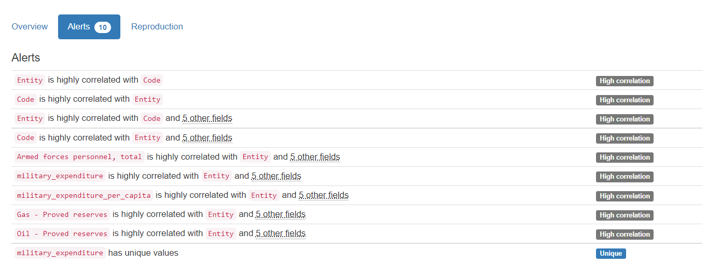

# Análisis multivariado

En este punto se nos pidieron 3 gráficas, sin embargo para los datos que se tienen, creo que sólo con 1 puedo explicar gran parte del insight de el merge de todos los 5 datasets:

Aquí se puede concluir lo siguiente:
1. El país que contiene la mayor cantidad de Gas en el Mundo y cuenta con un poder armamentístico relativamente grande es Rusia:
   
   a. En segundo lugar tenemos a Irán con mayor cantidad de reservas de gas y de aceite, NOTESE que durante el Gobierno de Bush [2001-2009] debilitaron el poder armamentístico del país, aunado a que hubo un aumento en el número de reservas de Petróleo y Gas, Irán es un punto estratégico para la producción de hidrocarburos y Estados Unidos buscaba mayor expansión y poder armamentístico

   b. Curiosamente es durante el gobierno de George H. W. Bush que USA aumenta su poder armamentístico hasta 2009 después de una caída abrupta y reducción de personal militar en el gobierno de Bill Clinton [1993-2001]

   c. Durante el Gobierno de Barack Obama [2009-2017] el poder armamentístico se ve reducido, esto debido a su política de seguros en el Sector Salud, se observa también que existe un aumento en las reservas de petróleo y gas de la nación debido a que durante su periodo se empezó a utilizar el FRACKING, una técnica petrolera que permitió fracturar las rocas que contenían hidrocarburo en yacimientos no convencionales (difíciles de explotar debido a que no hay buena conductividad en los poros de la roca), esta técnica consiste en inyectar fluido para fracturar las rocas y paquetes de arena (apuntalantes) que permiten mantener las fracturas abiertas por un cierto periodo de tiempo.

   d. Rusia por otro lado, durante el Gobierno de Putin [2000-Presente] aumentó la fuerza armamentística durante su largo periodo de mandato, lo que le permitió expandir también las reservas de Petróleo [gas en su mayoría] en todo lo que va de su mandato. Es importante reconocer que la demanda de gas por parte de Alemania a Rusia es un punto importante que hay que reconocer aquí, conforme aumentan los años la tasa de natalidad crece a nivel mundial en los países con clima subtropical y decrece en climas fríos, de ahí la disminución de poder en USA, Canada, Rusia, Ucrania, Reino Unido, etc.
   
2. India es un país con mucha desestabilización, ha ido incrementando su poder armamentístico con el paso del tiempo, a veces crece, a veces decae debido a guerras y golpes de estado, cabe recalcar que es uno de los 3 países con mayor numero de habitantes, el primero es China y le precide India
   
3. En el caso de China es uno de los países con el mayor número de habitantes, obviamente tendría que tener un mayor poder armamentístico hablándose de personas y por si fuera poco, también se observa una tendencia de nivel de reservas de hidrocarburos bastante considerable que le permite mantener una fuerza grande. Desde el gobierno de Xi Ying Ping se ha establecido la política de 1 solo hijo y eso ha ido mermando poco a poco con el pasar de los años su fuerza armamentística siendo en 2005 y 2016 superada por India.

4. Argentina y México no se encuentran en este análisis, pero su ponemos el TOP 21, veremos a México y en el TOP 30  a Argentina siendo países con poco poder armamentístico pero con una gran cantidad de petróleo. Parece ser que a menor poder armamentístico, mayor cantidad de minerales y reservas de petróleo existen en los países, pero menor poder militar, lo que les permite a las potencias mundiales entrar a desestabilizar a los países y extraer sus recursos. 
   
5. Existe un libro llamado "La riqueza de las naciones" el cual busco leer donde me han resumido que se tratan mucho estos temas interesantes, siendo sinceros creo que en este gráfico podemos analizar y resumir muchas cosas, podríamos utilizar la función where dentro del dataset para solo clasificar los países que queramos, en definitiva este curso me está encantando :D 

Por último, muestro las gráficas y correlaciones requetebonitas que se obtuvieron:

